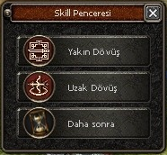

# 5 Level'de Uzaktan Beceri Seçme Ekranı

Sunucuya Yeni Başlayanlar İçin Kasılırken 5 Level Olduklarında Karşılarına Beceri Seçme Ekranı Çıkar

## Ekran Görüntüleri

  
## Source Klasörü

-Source Klasörünün İçerisinde Yer Alan Dosyaları Clientinizde Bulunan Aynı .cpp Bölümlerine Ekleyin

İçerisinde Detaylı Anlatım Mevcut

## Pack Klasörü

  Aynı Şekilde Pack Klasörünün İçerisinde Yer Alan .py Dosyalarını "Root" Pack Dosyalarınıza Anlatıldığı Gibi Ekleyin
  

  
## Yazarlar ve Teşekkür

- [@sunucubu](https://www.sunucubu.com) tasarım ve geliştirme için.

  
